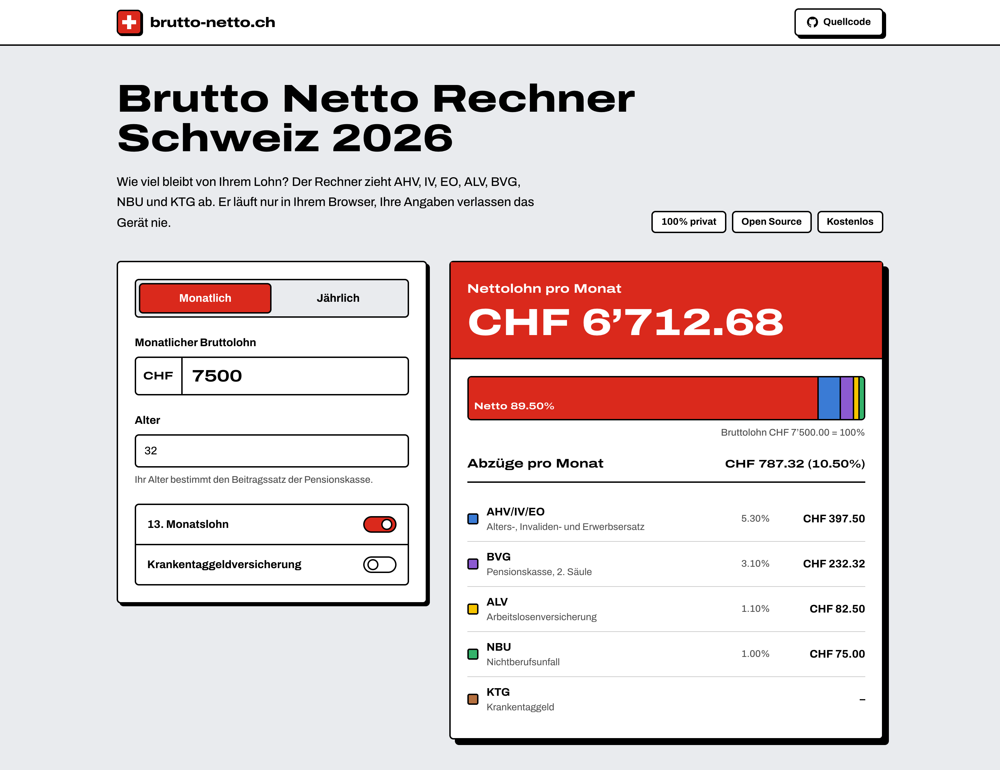
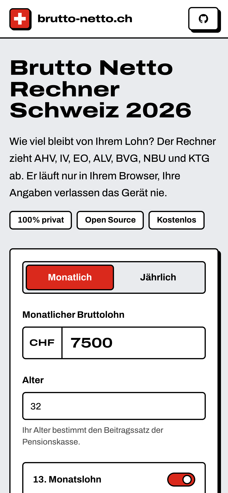
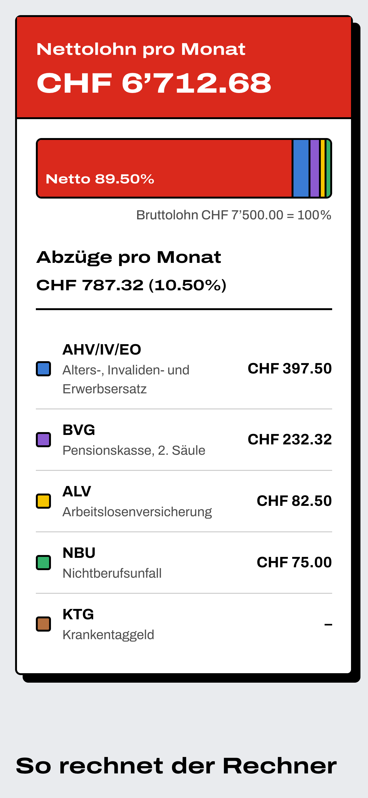

<div align="center">

<a href="https://brutto-netto.ch">
  <picture>
    <source media="(prefers-color-scheme: dark)" srcset="public/logo_white.svg">
    
  </picture>
</a>

### The Swiss gross-to-net salary calculator. Private, free and open source.

Enter your gross salary and see what reaches your bank account after AHV/IV/EO, ALV, BVG, NBU and KTG.
Everything runs in your browser, so your salary never leaves your device.

[](https://github.com/mwalterskirchen/brutto-netto.ch/actions/workflows/ci.yml)
[](LICENSE)
[](src/lib/deduction-rates.ts)
[](https://astro.build)

**[Open the calculator →](https://brutto-netto.ch)**

<br>

<picture>
  <source media="(prefers-color-scheme: dark)" srcset="docs/screenshots/desktop-dark.png">
  
</picture>

</div>

## Features

- **Monthly or annual.** Enter the gross salary per month or per year. The result follows the same period.
- **13th month salary.** Turn on the 13. Monatslohn and the calculator spreads the annual salary over 13 payments.
- **Age-based pension fund.** The BVG contribution follows your age group, from 0.8% to 10.1% of the coordinated salary.
- **Optional KTG.** Add the daily sickness benefit insurance when your employer deducts part of the premium.
- **Itemised result.** Every deduction shows its amount and its share of the gross salary. A colour strip shows the split at a glance.
- **Private by design.** The calculation runs in your browser, and your inputs are never sent anywhere. The site sets no cookies and only collects anonymous visit statistics with Cloudflare Web Analytics.
- **Works everywhere.** The layout works on phones and desktops, and follows your light or dark mode setting.

<p align="center">
  
  &nbsp;&nbsp;&nbsp;
  
</p>

## What the calculator deducts

The calculator deducts the employee share of the Swiss social insurance contributions. The rates are the same in every canton. Income tax is not included, because it depends on the canton and the municipality.

| Deduction     | Name                                        | Employee rate (2026)                                       |
| ------------- | ------------------------------------------- | ---------------------------------------------------------- |
| **AHV/IV/EO** | Old-age, disability and income compensation | 5.3% of the full gross salary                              |
| **ALV**       | Unemployment insurance                      | 1.1% up to CHF 148,200 per year, 0.5% on the part above it |
| **BVG**       | Occupational pension fund (2nd pillar)      | 0.8% to 10.1% of the coordinated salary, by age            |
| **NBU**       | Non-occupational accident insurance         | About 1%                                                   |
| **KTG**       | Daily sickness benefit insurance (optional) | About 0.8%                                                 |

The BVG contribution applies only from an annual salary of CHF 22,680. The coordinated salary is the annual salary minus CHF 26,460, with a minimum of CHF 3,780 and a maximum of CHF 64,260.

The NBU, KTG and BVG rates are typical values. Your employer's insurance and pension fund can use different rates, so treat the result as an estimate. All rates and their sources are in [`src/lib/deduction-rates.ts`](src/lib/deduction-rates.ts).

## Tech stack

- [Astro 7](https://astro.build) builds a fully static site.
- [React](https://react.dev) islands power the calculator and the FAQ.
- [Tailwind CSS 4](https://tailwindcss.com) and [shadcn/ui](https://ui.shadcn.com) with [neobrutalism.dev](https://www.neobrutalism.dev) components do the styling.
- [Vitest](https://vitest.dev) tests the calculation.
- [Cloudflare Pages](https://pages.cloudflare.com) hosts the site.

## Getting started

You need Node.js 22.12 or later and [pnpm](https://pnpm.io).

```bash
pnpm install   # Install the dependencies
pnpm dev       # Start the dev server on http://localhost:4321
pnpm test      # Run the tests
pnpm build     # Type-check and build the site into dist/
pnpm preview   # Serve the production build locally
```

### Project structure

```text
src/
├── components/    Calculator, FAQ, header, footer and shadcn/ui components
├── layouts/       The page layout with the meta tags
├── lib/
│   ├── calculator.ts        The net salary calculation
│   ├── calculator.test.ts   The tests for the calculation
│   └── deduction-rates.ts   The rates and thresholds for the current year
├── pages/         The calculator, the privacy policy and the disclaimer
└── styles/        The theme tokens and global styles
```

### Updating the rates

The federal authorities publish new thresholds every autumn. To update the calculator for a new year, change the values in [`src/lib/deduction-rates.ts`](src/lib/deduction-rates.ts), update the snapshot tests with `pnpm test -u`, and check the texts on the page that mention the rates.

## Deployment

The [CI workflow](.github/workflows/ci.yml) tests and builds every pull request. Every push to `main` also deploys the site to Cloudflare Pages.

To deploy by hand, run `pnpm run deploy`. To deploy a preview, run `pnpm run deploy:preview`.

## Contributing

Bug reports and pull requests are welcome. If a rate is wrong or out of date, please open an issue with a link to the official source.

## Disclaimer

The calculator gives an estimate. It does not replace your payslip or advice from a payroll expert. See the [Haftungsausschluss](https://brutto-netto.ch/haftungsausschluss) for details.

## License

[MIT](LICENSE) © Maximilian Walterskirchen
